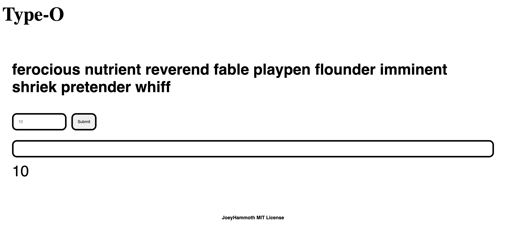

# Type-O


Type-O is a fun, fast-paced monkey-type/typeracer clone built with React. It challenges you to test your typing speed and accuracy by dynamically displaying words and allowing you to set your own challenge parameters.

## Features

- **Real-time Typing Challenge:** Type words as they appear on the screen.
- **Customizable Word Count:** Adjust the number of words for each challenge using a dedicated input.
- **Responsive UI:** Clean, simple interface built with React.
- **Keyboard Event Handling:** The text input listens for key events (e.g., pressing "Enter") to trigger actions.
- **Easy to Extend:** Modular code structure makes it simple to add new features and improvements.

## Getting Started

Follow these instructions to set up the project locally.

### Prerequisites

- **Node.js** (version 12 or above)
- **npm** or **yarn**

### Installation

1. **Clone the repository:**

   ```bash
   git clone https://github.com/JoeyHammoth/monkeytype-clone.git
   cd monkeytype-clone
   ```

2. **Install dependencies:**

   Using npm:
   ```bash
   npm install
   ```
   Or using yarn:
   ```bash
   yarn install
   ```

### Running the Project

Start the development server with:

```bash
npm start
```

Then, open [http://localhost:3000](http://localhost:3000) in your browser to view the app.

### Building for Production

To create an optimized production build, run:

```bash
npm run build
```

This command bundles the app into static files in the `build` directory.

## Code Overview

The core of Type-O is a React component that renders the main game interface. Below is a simplified example of the component structure:

```jsx
return (
    <div className="word-container">
        <h2>{wordList.join(" ")}</h2>
        <div className="input-section">
            <input className="input-num" type="number" placeholder="10" />
            <button className="btn-submit" onClick={changeWords}>Submit</button>
        </div>
        <div className="input-words">
            <input
                className="type-input"
                type="text"
                onKeyDown={(e) => {
                    if (e.key === "Enter") {
                        console.log("Enter");
                    }
                }}
            />
        </div>
    </div>
);
```

### Key Points:

- **Event Handling:**  
  The `onClick` event on the button triggers the `changeWords` function, while the text input uses the `onKeyDown` event to handle the "Enter" key press.

- **JSX Structure:**  
  All UI elements are wrapped in semantic containers, and inline event handlers are used for clarity.

- **Separation of Concerns:**  
  Styling is handled via CSS classes (`word-container`, `input-section`, `input-num`, `btn-submit`, `type-input`), making it easy to update the design without modifying functionality.

## Contributing

Contributions are welcome! If you'd like to improve Type-O, please follow these steps:

1. Fork the repository.
2. Create a new branch for your feature or bug fix:
   ```bash
   git checkout -b feature/YourFeature
   ```
3. Commit your changes:
   ```bash
   git commit -m "Add your message here"
   ```
4. Push to your fork and open a pull request.

For major changes, please open an issue first to discuss what you would like to change.

## License

This project is licensed under the MIT License. See the [LICENSE](LICENSE) file for details.

## Acknowledgments

- **Inspiration:**  
  Type-O is inspired by popular typing platforms like MonkeyType and Typeracer.
- **React Community:**  
  Thanks to the React community for providing an excellent framework for building interactive UIs.

Happy Typing!